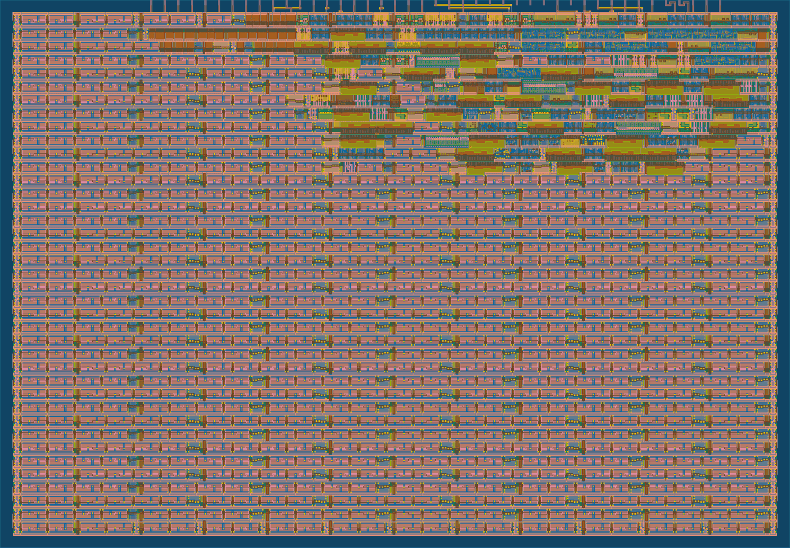

   

# RS232 written for ASIC

This is a RS232 reciever and transmitter written as an educational project to understand the basics of ASIC design

- [Implementation details](docs/info.md)

## Routing stats

| Utilisation (%) | Wire length (um) |
|-------------|------------------|
| 11.15 | 3583 |

## Cell usage by Category

| Category | Cells | Count |
|---------------|----------|-------|
|Fill | [decap](https://skywater-pdk.readthedocs.io/en/main/contents/libraries/sky130_fd_sc_hd/cells/decap) [fill](https://skywater-pdk.readthedocs.io/en/main/contents/libraries/sky130_fd_sc_hd/cells/fill) | 1340|
|Tap | [tapvpwrvgnd](https://skywater-pdk.readthedocs.io/en/main/contents/libraries/sky130_fd_sc_hd/cells/tapvpwrvgnd) | 225|
|Misc | [conb](https://skywater-pdk.readthedocs.io/en/main/contents/libraries/sky130_fd_sc_hd/cells/conb) [dlymetal6s2s](https://skywater-pdk.readthedocs.io/en/main/contents/libraries/sky130_fd_sc_hd/cells/dlymetal6s2s) [dlygate4sd3](https://skywater-pdk.readthedocs.io/en/main/contents/libraries/sky130_fd_sc_hd/cells/dlygate4sd3) | 61|
|Flip Flops | [dfrtp](https://skywater-pdk.readthedocs.io/en/main/contents/libraries/sky130_fd_sc_hd/cells/dfrtp) [dfxtp](https://skywater-pdk.readthedocs.io/en/main/contents/libraries/sky130_fd_sc_hd/cells/dfxtp) | 43|
|Buffer | [buf](https://skywater-pdk.readthedocs.io/en/main/contents/libraries/sky130_fd_sc_hd/cells/buf) [clkbuf](https://skywater-pdk.readthedocs.io/en/main/contents/libraries/sky130_fd_sc_hd/cells/clkbuf) | 38|
|Combo Logic | [and2b](https://skywater-pdk.readthedocs.io/en/main/contents/libraries/sky130_fd_sc_hd/cells/and2b) [o211a](https://skywater-pdk.readthedocs.io/en/main/contents/libraries/sky130_fd_sc_hd/cells/o211a) [a21bo](https://skywater-pdk.readthedocs.io/en/main/contents/libraries/sky130_fd_sc_hd/cells/a21bo) [a31o](https://skywater-pdk.readthedocs.io/en/main/contents/libraries/sky130_fd_sc_hd/cells/a31o) [and4b](https://skywater-pdk.readthedocs.io/en/main/contents/libraries/sky130_fd_sc_hd/cells/and4b) [or4b](https://skywater-pdk.readthedocs.io/en/main/contents/libraries/sky130_fd_sc_hd/cells/or4b) [a32o](https://skywater-pdk.readthedocs.io/en/main/contents/libraries/sky130_fd_sc_hd/cells/a32o) [or3b](https://skywater-pdk.readthedocs.io/en/main/contents/libraries/sky130_fd_sc_hd/cells/or3b) [o21ai](https://skywater-pdk.readthedocs.io/en/main/contents/libraries/sky130_fd_sc_hd/cells/o21ai) [o221a](https://skywater-pdk.readthedocs.io/en/main/contents/libraries/sky130_fd_sc_hd/cells/o221a) [a211o](https://skywater-pdk.readthedocs.io/en/main/contents/libraries/sky130_fd_sc_hd/cells/a211o) [a22o](https://skywater-pdk.readthedocs.io/en/main/contents/libraries/sky130_fd_sc_hd/cells/a22o) [a21o](https://skywater-pdk.readthedocs.io/en/main/contents/libraries/sky130_fd_sc_hd/cells/a21o) | 29|
|AND | [and3](https://skywater-pdk.readthedocs.io/en/main/contents/libraries/sky130_fd_sc_hd/cells/and3) [and2](https://skywater-pdk.readthedocs.io/en/main/contents/libraries/sky130_fd_sc_hd/cells/and2) | 19|
|Multiplexer | [mux2](https://skywater-pdk.readthedocs.io/en/main/contents/libraries/sky130_fd_sc_hd/cells/mux2) | 15|
|OR | [or2](https://skywater-pdk.readthedocs.io/en/main/contents/libraries/sky130_fd_sc_hd/cells/or2) [or3](https://skywater-pdk.readthedocs.io/en/main/contents/libraries/sky130_fd_sc_hd/cells/or3) | 12|
|NOR | [nor2](https://skywater-pdk.readthedocs.io/en/main/contents/libraries/sky130_fd_sc_hd/cells/nor2) | 5|
|NAND | [nand2](https://skywater-pdk.readthedocs.io/en/main/contents/libraries/sky130_fd_sc_hd/cells/nand2) | 2|
|Inverter | [inv](https://skywater-pdk.readthedocs.io/en/main/contents/libraries/sky130_fd_sc_hd/cells/inv) | 2|
## 226 total cells (excluding fill and tap cells)

## What is Tiny Tapeout?

Tiny Tapeout is an educational project that aims to make it easier and cheaper than ever to get your digital and analog designs manufactured on a real chip.

To learn more and get started, visit https://tinytapeout.com.

The GitHub action will automatically build the ASIC files using [OpenLane](https://www.zerotoasiccourse.com/terminology/openlane/).

## Resources

- [FAQ](https://tinytapeout.com/faq/)
- [Digital design lessons](https://tinytapeout.com/digital_design/)
- [Learn how semiconductors work](https://tinytapeout.com/siliwiz/)
- [Join the community](https://tinytapeout.com/discord)
