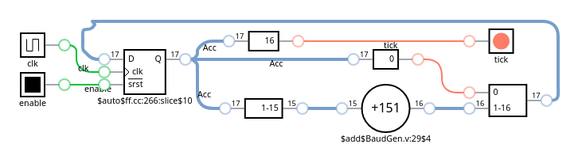
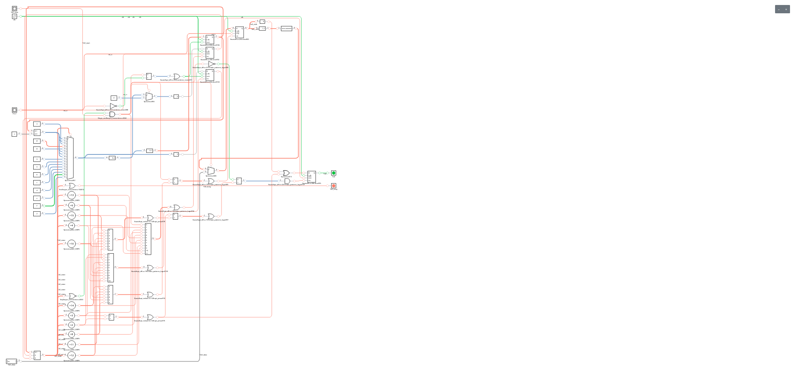

<!---

This file is used to generate your project datasheet. Please fill in the information below and delete any unused
sections.

You can also include images in this folder and reference them in the markdown. Each image must be less than
512 kb in size, and the combined size of all images must be less than 1 MB.
-->

## How it works

The code written is self documented. For a quick understanding please refer
to the block diagrams created

### BaudGen.v

### async_transmitter.v

### async_.v

## How to test
Run `make all` to see testbench results

## External hardware